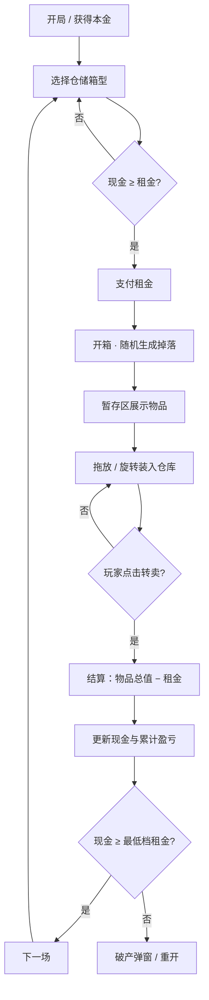
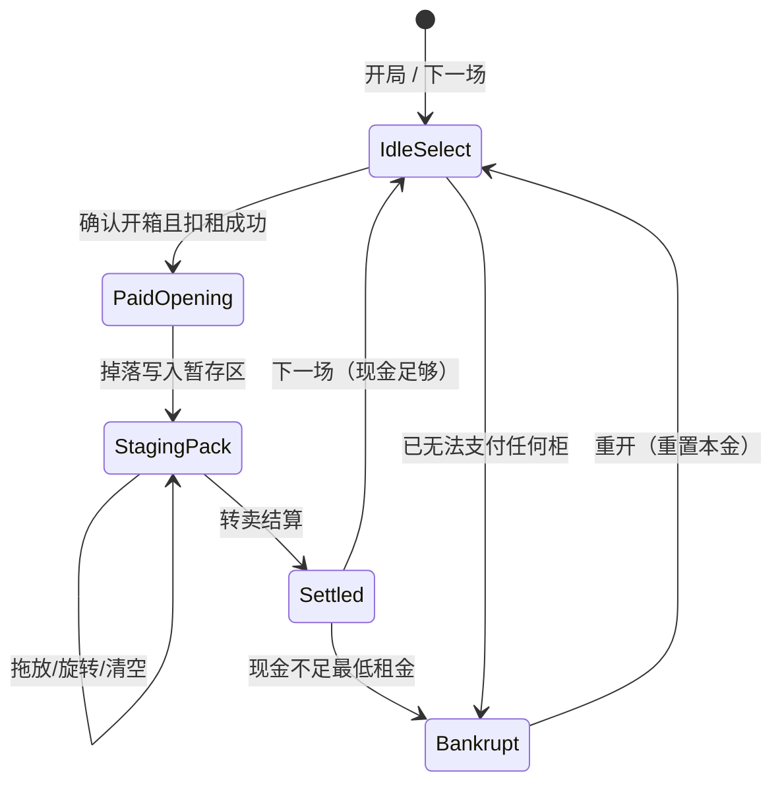

# 仓储拍卖开箱 — 技术方案（初稿）

## 1. 文档信息

| 项 | 内容 |
|---|---|
| 文档名称 | 仓储拍卖开箱 / 格子仓库游戏 — 技术方案 |
| 工作标题 | 仓储拍卖开箱（三角洲式格子背包体验） |
| 版本 | **v0.1 初稿** |
| 日期 | 2026-09-22 |
| 状态 | **待评审** |
| 读者 | 产品 / 前端工程 |
| 首发形态 | 浏览器 SPA，无构建（HTML / CSS / JS） |

> 文中标注 **【可调参数】** 的数值均为占位，评审时可改。标注 **「待你确认」** 的为开放问题。

---

## 2. 背景与目标

### 2.1 背景

玩家扮演仓储拍卖买家：向房东支付租金，打开密封仓储单元（集装箱/储物柜），获得形状各异的战利品；将物品拖入 N×N 格子仓库整理装箱，再结算转卖盈亏。体验对标「三角洲」式格子背包 + 美式 storage-unit auction 叙事。

### 2.2 目标

| 目标 | 说明 |
|---|---|
| 核心循环可玩 | 租柜 → 开箱 → 装箱 → 结算 → 再租，单局 2–5 分钟 |
| 格子操作手感 | 拖放、旋转、碰撞反馈清晰；形状多样 |
| 稀有度可读 | 八档稀有度视觉区分明显，红档极稀有 |
| 经济张力 | 租金成本 vs 随机收益；可能盈利也可能亏本乃至破产 |
| 交付约束 | 纯前端、无构建、单页即可打开游玩；资源自绘，避免侵权 |

### 2.3 非目标（本期不做）

- 账号 / 存档云同步 / 排行榜
- 真实支付、广告、联网对战
- 复杂 3D / 物理引擎
- 完整剧情战役

---

## 3. 核心玩法与用户流程

### 3.1 一句话玩法

**付租金开密封柜 → 随机掉落异形物品 → 塞进格子仓库 → 按物品价值结算本轮盈亏。**

### 3.2 主流程（文字）

1. 开局获得本金，进入第 1 场。
2. 选择箱型（普通 / 精选 / 密封），预览租金；现金不足则不可选。
3. 确认开箱：扣除租金；展示开箱动画与掉落清单。
4. 掉落进入「暂存区」；玩家拖入仓库格子，可旋转、挪动、清空重排。
5. 点击「转卖结算」：按已装箱物品总价值入账，减去本轮租金得到净盈亏；未装箱物品按规则丢弃或折价（见开放问题）。
6. 进入下一场；若现金不足以支付最低档租金 → 破产结束，可重开。

### 3.3 流程图



### 3.4 状态机（概要）

见 §8.4。场次内关键状态：`idle_select` → `paid_opening` → `staging_pack` → `settled` →（下一场或 `bankrupt`）。

---

## 4. 功能需求清单

### P0（MVP 必达）

| ID | 需求 | 验收要点 |
|---|---|---|
| P0-01 | 三档箱型选择与租金扣除 | 选柜、付费、余额不足禁用 |
| P0-02 | 加权随机掉落（八档稀有度） | 红档极低、白/绿常见；箱型有权重修正 |
| P0-03 | 物品异形占格 + 碰撞检测 | 越界/重叠不可放置，有视觉反馈 |
| P0-04 | 拖放装入仓库；R 键 / 按钮旋转 | 90°×4；旋转后仍可合法放置 |
| P0-05 | 暂存区 ↔ 仓库移动 | 未装入物品不参与结算（或按确认规则） |
| P0-06 | 转卖结算与盈亏展示 | 本轮：总值 − 租金；更新现金、累计 PnL |
| P0-07 | 破产判定与重开 | 现金 < 最低租金 → 破产 |
| P0-08 | 顶栏 HUD | 现金、容量、待售估价、累计盈亏、场次 |
| P0-09 | 无构建 SPA | `index.html` + `style.css` + `game.js` 本地可开 |

### P1（首版后优先）

| ID | 需求 |
|---|---|
| P1-01 | 开箱扫描 / 掉落揭晓动画 |
| P1-02 | 物品详情面板（名称、稀有度、价值、形状） |
| P1-03 | 场次日志 / 历史摘要 |
| P1-04 | 仓库尺寸切换（8×8 / 10×10 / 12×12） |
| P1-05 | 帮助弹窗 + 快捷键说明 |
| P1-06 | 本地 `localStorage` 轻量存档（现金、场次） |

### P2（远期）

| ID | 需求 |
|---|---|
| P2-01 | 更多箱型 / 事件柜（诅咒柜、盲盒加成） |
| P2-02 | 成就 / 图鉴收集 |
| P2-03 | 音效与轻量 BGM（自研或授权） |
| P2-04 | 自动整理（一键装箱启发式） |
| P2-05 | 移动端触控优化与响应式布局增强 |

---

## 5. 稀有度与掉落系统设计

### 5.1 稀有度阶梯（高 → 低）

| 等级 | ID | 显示名 | 建议色 | 价值区间建议【可调参数】 | 基础权重【可调参数】 |
|---|---|---|---|---|---|
| 1 | `dahong` | 大红 | `#ff2a2a` | 80,000 – 160,000 | 0.35 |
| 2 | `xiaohong` | 小红 | `#e85a5a` | 35,000 – 60,000 | 1.0 |
| 3 | `dajin` | 大金 | `#f5c518` | 18,000 – 30,000 | 2.2 |
| 4 | `xiaojin` | 小金 | `#d4a84b` | 7,000 – 13,000 | 4.5 |
| 5 | `purple` | 紫色 | `#a855f7` | 2,500 – 5,500 | 9 |
| 6 | `blue` | 蓝色 | `#3b82f6` | 900 – 1,600 | 16 |
| 7 | `green` | 绿色 | `#22c55e` | 250 – 600 | 28 |
| 8 | `white` | 白色 | `#e5e7eb` | 80 – 180 | 40 |

> 抽样算法：对每件掉落，按 `weight = max(0.01, weightBase × tierMult[rarity])` 加权抽取稀有度，再从该稀有度物品池均匀取一件（价值可用固定表或区间抖动【待你确认】）。

### 5.2 箱型与掉落修正【可调参数】

| 箱型 | ID | 租金建议 | 件数区间 | 稀有度乘数（相对基础）要点 |
|---|---|---|---|---|
| 普通柜 | `common` | **500** | 4–6 | 白/绿↑；金/红↓（如红 ×0.3） |
| 精选柜 | `rare` | **1,500** | 5–8 | 蓝/紫略↑；小金偶现；红仍低 |
| 密封柜 | `sealed` | **4,000** | 6–10 | 金/红乘数显著↑；白略↓ |

示例乘数表（评审可改）：

| 稀有度 | common | rare | sealed |
|---|---|---|---|
| white | 1.4 | 1.0 | 0.7 |
| green | 1.3 | 1.1 | 0.85 |
| blue | 1.0 | 1.2 | 1.1 |
| purple | 0.7 | 1.3 | 1.4 |
| xiaojin | 0.4 | 1.0 | 1.6 |
| dajin | 0.25 | 0.8 | 1.8 |
| xiaohong | 0.15 | 0.5 | 1.5 |
| dahong | 0.08 | 0.35 | 1.2 |

### 5.3 期望收益直觉（设计校核）

- 普通柜：多数场次微亏或小赚，偶尔打平以上。
- 精选柜：波动更大，期望接近租金或略正。
- 密封柜：高方差——常亏，偶有大红回血。
- **「待你确认」**：是否要做「软保底」（连续 N 场无金以上则加权提升）？

---

## 6. 物品与格子系统设计

### 6.1 仓库

| 项 | 建议【可调参数】 |
|---|---|
| 默认尺寸 | **10×10** |
| 可选尺寸 | 8×8 / 10×10 / 12×12 |
| 单元格 | CSS Grid；`--cell-size` 控制视觉大小 |
| 占用表示 | `grid[r][c] = null \| { uid, defId, rot, ox, oy }` |

场次中途改尺寸：**「待你确认」**——清空重排 / 禁止已有物品时切换 / 仅下一场生效。

### 6.2 形状库

形状以相对坐标 cell 列表定义（原点归一化到左上）。示例：

| shape key | 占格示意 | 备注 |
|---|---|---|
| `1x1` | ■ | 最小件 |
| `1x2` / `2x1` | ■■ | 条状 |
| `1x3` | ■■■ | |
| `2x2` | 方块 | |
| `L` / `L2` | L 形 | |
| `T` | T 形 | |
| `S` | S/Z 形 | |
| `plus` | 十字 | |
| `fat` / `wide` / `bigL` | 大件 | 红金档常用 |

### 6.3 旋转

- 每次旋转 +90°（`rot ∈ {0,1,2,3}`）。
- 算法：`(r,c) → (c, -r)` 后平移使 `minR=minC=0`。
- 放置前用旋转后坐标做边界与占用检测。

### 6.4 碰撞与放置规则

1. 所有占格必须在 `[0, N)` 内。
2. 目标格为空，或仅被**同一 uid** 占用（自身挪动）。
3. 合法：高亮绿；非法：红 + 不可落点。
4. 从仓库拖回暂存区：清除该 uid 占用。

### 6.5 物品定义字段

见 §8.3 `ItemDef`。每件实例另有 `uid`、`rot`、可选 `valueOverride`。

---

## 7. 经济系统

### 7.1 货币与本金

| 项 | 建议【可调参数】 | 说明 |
|---|---|---|
| 起始现金 | **10,000** | 开局一次发放 |
| 货币符号 | ¥ | 仅表现，无真实支付 |
| 显示 | 千分位，整数 | 如 `¥10,000` |

> 现有原型若使用其他本金/租金，以本文【可调参数】为准做对齐，或在评审中改本文数字。

### 7.2 租金（成本）

三档见 §5.2：`500 / 1,500 / 4,000`。【可调参数】

- 开箱时立即扣款；记入本轮 `paidFee`。
- 同一场只开一次箱（P0）；P2 可扩展「加开」。

### 7.3 结算

```
lootValue   = Σ value(已装入仓库的物品)
netPnL      = lootValue − paidFee
cash       += lootValue          // 租金已在开箱时扣除，故此处只加卖出额
totalPnL   += netPnL
```

- **未装入暂存区的物品**：P0 建议 **丢弃且不计价值**（迫使玩家做空间取舍）。**「待你确认」**
- HUD「待售估价」= 当前仓库内物品价值合计（不含暂存）。

### 7.4 破产

- 条件：结算后（或任意时刻检查）`cash < min(各档租金)` 且无法再开任何柜。
- 表现：破产弹窗展示最终现金与累计盈亏；提供「重新开始」。
- **「待你确认」**：是否允许「贱卖仓库内物品换现金」作为破产前最后手段？

### 7.5 经济平衡注意点

- 大红单件价值应显著高于密封柜租金，但基础权重极低。
- 避免「永远正期望」；密封柜方差要大。
- 仓库容量限制导致高价值大件可能装不下 → 策略深度。

---

## 8. 技术方案

### 8.1 前端架构

```
delta-stash-game/
├── index.html      # 结构：顶栏 / 箱型 / 暂存 / 仓库 / 弹窗
├── style.css       # 主题、格子、稀有度光效、响应式
├── game.js         # IIFE：数据 + 逻辑 + 渲染 + 事件
└── docs/
    └── techreport.md # 本文档
```

| 原则 | 说明 |
|---|---|
| 无构建 | 无打包器、无框架依赖（可选后续引入） |
| 单页 | 原生 DOM；`querySelector` 缓存节点 |
| 数据驱动 | 稀有度 / 箱型 / 物品 / 形状均为常量表 |
| 渲染 | 状态变更后局部 `render*()`，避免重框架 |

### 8.2 模块划分（逻辑分层，仍可单文件）

| 模块 | 职责 |
|---|---|
| `config` | 本金、租金、权重、尺寸等【可调参数】 |
| `defs` | `RARITIES` / `CRATE_TIERS` / `SHAPES` / `ITEM_DEFS` |
| `rng` | `weightedPick` / `rollLoot` |
| `grid` | 占用、碰撞、旋转、清空 |
| `economy` | 扣租、结算、破产 |
| `state` | 场次状态机、选中项、拖拽态 |
| `ui` | DOM 更新、弹窗、HUD |
| `input` | 指针拖放、键盘快捷键 |

### 8.3 数据模型 JSON 示例

```json
{
  "meta": { "version": 1, "savedAt": "2026-09-22T15:26:00+08:00" },
  "player": {
    "cash": 10000,
    "totalPnL": 0,
    "round": 1
  },
  "warehouse": {
    "size": 10,
    "cells": [],
    "placed": [
      {
        "uid": "i12",
        "defId": "medkit",
        "rot": 1,
        "anchor": [2, 3]
      }
    ]
  },
  "round": {
    "selectedTier": "rare",
    "paidFee": 1500,
    "crateOpened": true,
    "extracted": false,
    "staging": [
      { "uid": "i13", "defId": "gold_watch", "rot": 0 }
    ]
  }
}
```

**ItemDef 示例：**

```json
{
  "id": "crimson_crate",
  "name": "绯红封印匣",
  "shape": "bigL",
  "rarity": "dahong",
  "value": 120000,
  "icon": "svg:crimson-crate"
}
```

**CrateTier 示例：**

```json
{
  "id": "sealed",
  "name": "密封柜",
  "fee": 4000,
  "count": [6, 10],
  "mult": {
    "white": 0.7,
    "dahong": 1.2
  }
}
```

### 8.4 场次状态机



| 状态 | 允许操作 |
|---|---|
| `IdleSelect` | 选箱型、开箱、改仓库尺寸（若规则允许）、帮助 |
| `PaidOpening` | 播放开箱 UI（短暂，自动进入） |
| `StagingPack` | 拖放、旋转、清空仓库、转卖 |
| `Settled` | 查看结果、进入下一场 |
| `Bankrupt` | 仅重开 |

---

## 9. UI/UX 草案

### 9.1 主要界面

| 区域 | 内容 |
|---|---|
| 顶栏 | 品牌名、现金、容量、待售估价、累计盈亏、场次、仓库尺寸、帮助 |
| 左栏 | 三档仓储单元卡片 + 租金预览 +「支付并开箱」 |
| 中栏 | 暂存区（未装箱掉落） |
| 右栏 / 主区 | N×N 仓库网格 + 旋转 / 清空 / 转卖 |
| 侧栏 | 物品详情、操作说明、场次日志 |
| 浮层 | 开箱扫描、结算结果、帮助、破产 |

### 9.2 交互

- **拖放**：指针按下拾取 → 幽灵跟随 → 格上高亮 → 松开放置或回弹。
- **旋转**：选中物品后 `R` 或「旋转」按钮；拖拽中亦可旋转（P1）。
- **点击选中**：显示详情与可装区域提示。
- **禁用态**：已开箱后箱型按钮禁用；未放置任何物品时「转卖」禁用（或允许空仓结算亏租金——**「待你确认」**）。

### 9.3 视觉反馈

- 稀有度边框 / 外发光与名称色一致。
- 合法格：半透明绿；非法：红。
- 结算净利：绿正红负。

### 9.4 无障碍与快捷键

| 键 | 作用 |
|---|---|
| `R` | 旋转选中 / 拖拽中物品 |
| `Esc` | 关闭弹窗 / 取消拖拽 |
| `?` | 打开帮助 |
| `Enter` | 确认主操作（开箱 / 结果下一步）— P1 |

- 关键按钮带 `aria-label`；弹窗 `hidden` 切换；色觉以外用文字标明稀有度名。
- **「待你确认」**：是否需要完整键盘挪格（方向键移动幽灵）？

---

## 10. 资源与美术策略

| 策略 | 说明 |
|---|---|
| 优先 | 自绘 **SVG / CSS** 几何图标与光效；emoji 仅作原型占位 |
| 禁止 | 复制其他游戏贴图、商标、角色；勿用未授权素材站商用图 |
| 稀有度 | 纯 CSS `box-shadow` / `border` / 渐变区分八档 |
| 开箱动画 | CSS transition / 简单 DOM 序列，不引入视频 |
| 音效（P2） | 自录或 CC0；单独清单管理授权 |

替换路径：`ItemDef.icon` 从 emoji 字符串 → `svg:<id>` 映射到内联 SVG sprite。

---

## 11. 里程碑与交付物

| 阶段 | 目标 | 交付物 |
|---|---|---|
| **M0 原型** | 可点通主循环 | `index.html` / `style.css` / `game.js` 可玩 build |
| **M1 MVP** | P0 全部验收 + 参数表可调 | 可调 `config` 区块；本技术方案评审通过 |
| **M2 打磨** | P1 动画、详情、帮助、尺寸切换、本地存档 | 体验更完整的 SPA |
| **M3 内容扩** | 扩物品池、平衡、SVG 图标替换 emoji | 内容与美术清单 |
| **M4 选修** | P2 图鉴 / 音效 / 自动整理 / 触控 | 视评审排期 |

每阶段出口标准：主流程无阻断 bug；经济参数有文档；已知问题列表更新。

---

## 12. 风险与待决事项

### 12.1 风险

| 风险 | 影响 | 缓解 |
|---|---|---|
| 掉落期望过高/过低 | 无聊或挫败 | 权重与价值表可调；加简单统计面板内测 |
| 大件过多装不下 | 挫败 | 控制大红形状面积；暂存可弃 |
| 拖放在移动端难用 | 触控差 | P2 触控；MVP 先桌面 |
| 侵权素材 | 法律风险 | 仅自绘 SVG/CSS |
| 无构建单文件膨胀 | 维护难 | 逻辑分区注释；必要时再拆多 JS |

### 12.2 开放问题（「待你确认」）

1. **起始本金**：设计稿 10,000 vs 原型可能的其他值，以哪版为准？
2. **三档租金**：定稿 500 / 1,500 / 4,000？是否要随场次通胀？
3. **未装箱物品**：丢弃不计价 / 强制必须全装才能结算 / 自动折价卖出？
4. **空仓转卖**：是否允许只亏租金？
5. **改仓库尺寸时机**：随时清空 / 仅未开箱时 / 仅下场生效？
6. **价值抖动**：固定表价 vs 开箱时 ±10% 随机？
7. **软保底**：是否需要连续倒霉加权？
8. **破产前贱卖**：是否开放一键清空仓库换现？
9. **正式中文名**：工作标题「仓储拍卖开箱」是否定名？英文副标题是否需要？
10. **存档**：MVP 要不要 `localStorage`？

---

## 13. 附录：术语表

| 术语 | 含义 |
|---|---|
| 仓储单元 / 柜 / 箱 | 玩家付租金打开的密封容器 |
| 租金 / 开箱费 | 支付给「房东」的固定成本 |
| 暂存区 | 开箱后、尚未装入仓库的物品列表 |
| 仓库 / 格子背包 | N×N 网格，用于摆放异形物品 |
| 占格 / footprint | 物品在网格上占用的 cell 集合 |
| 稀有度 | 八档：大红→白色，影响颜色、价值、掉率 |
| 转卖 / 结算 / 提取 | 将仓库内物品按价值变现并结束本场装箱 |
| 场次 / round | 一次「选柜→开箱→装箱→结算」循环 |
| 累计盈亏 / totalPnL | 开局至今各场净利之和 |
| 破产 | 现金不足以支付任何一档租金 |
| 箱型乘数 | 某柜对稀有度权重的修正系数 |
| 【可调参数】 | 文档中可评审修改的数值占位 |
| 「待你确认」 | 需产品拍板的开放问题 |

---

*文档结束 — v0.1 初稿 · 2026-09-22 · 状态：待评审*
